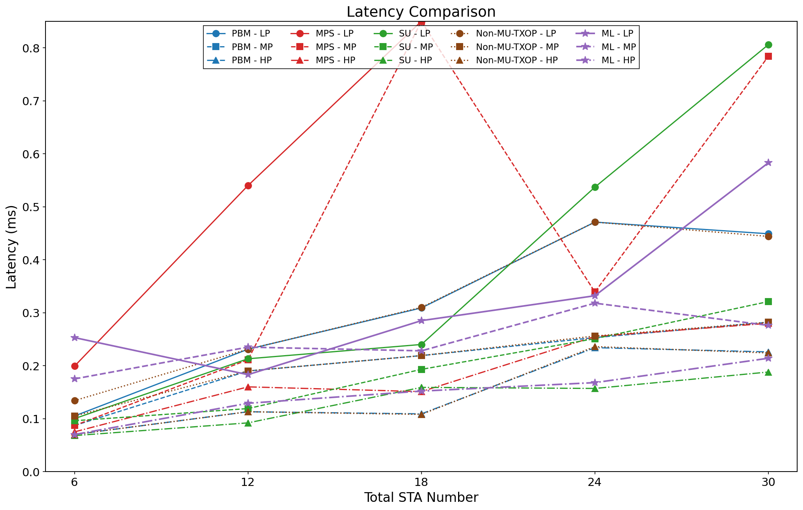
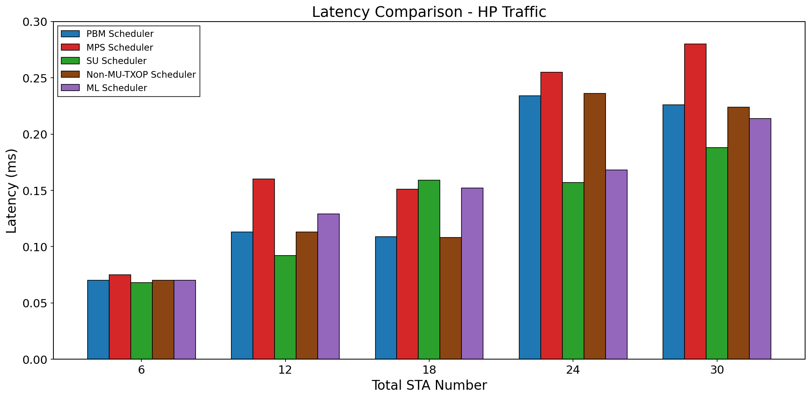
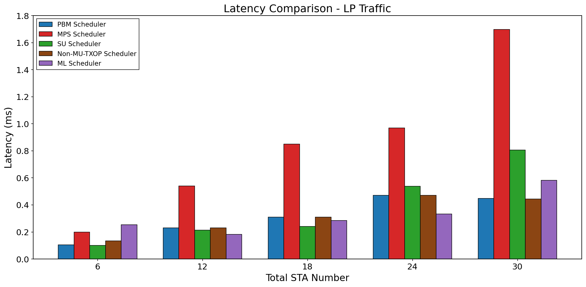
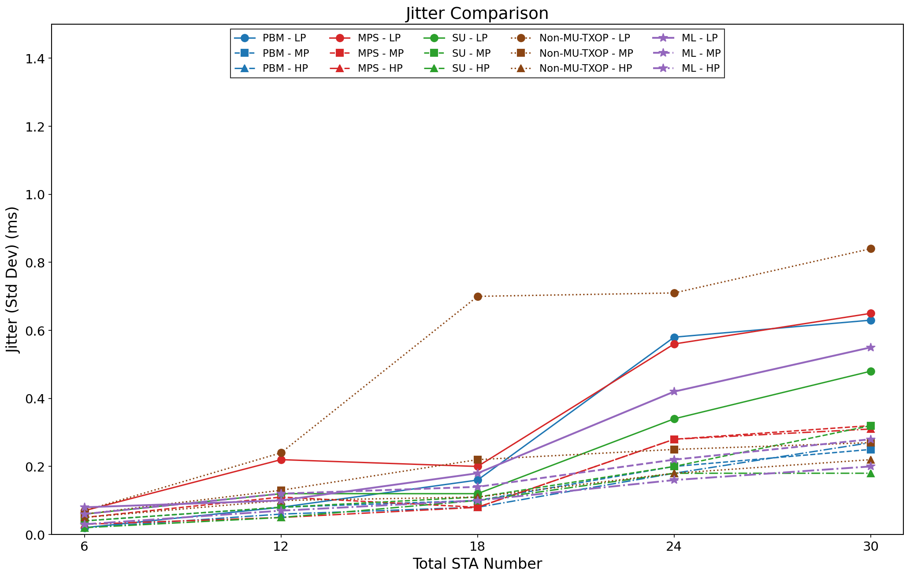
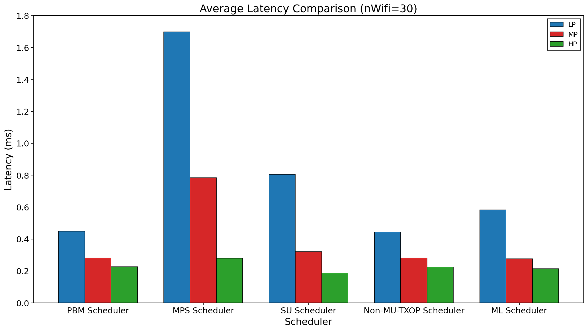
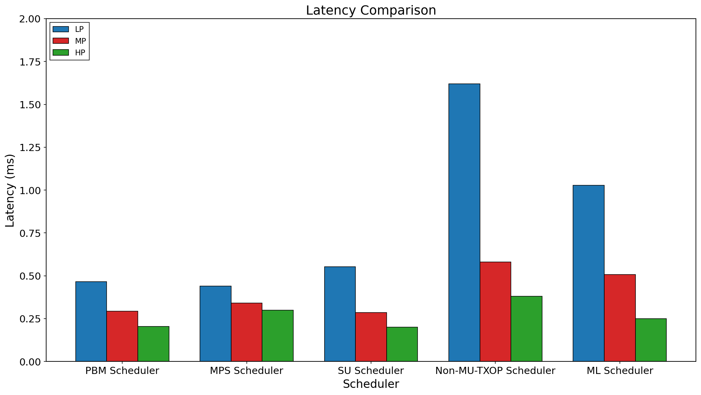
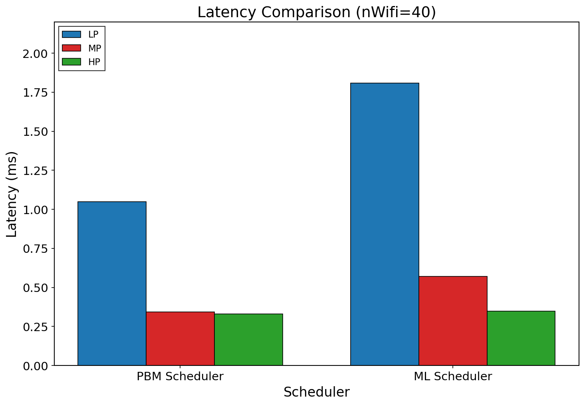

# ML Baseline for Wi-Fi 6 MU-TXOP Scheduler

---

## 研究動機

- 評估 **Data-driven (ML)** vs **Rule-based (PBM/MPS)** 方法
- 探討 ML 在 Wi-Fi 6 資源調度的可行性
- 了解 Domain Knowledge 在 ML 系統中的重要性

---

## ML Scheduler 架構

### Neural Network: MLP (Multi-Layer Perceptron)

| Layer | Neurons | Activation |
|-------|---------|------------|
| Input | 12 | - |
| Hidden 1 | 64 | ReLU |
| Hidden 2 | 32 | ReLU |
| Output | 11 | Softmax |

**Total Parameters: 3,275**

---

## 輸入特徵 (12 維)

| Feature | Description |
|---------|-------------|
| Primary/Secondary STA Count | 候選 STA 數量 |
| AC Queue Lengths (×4) | 各 AC 佇列長度 |
| Packet Size Ratio | 封包大小比例 |
| Waiting Credits | 等待時間權重 |
| AC Types | Primary/Secondary AC 類型 |

---

## Two-Stage Decision Architecture

```
┌──────────────────────────────────────┐
│         Stage 1: Sharing Gate        │
│  ─────────────────────────────────── │
│  有 Secondary 候選？ 封包比例有效？   │
│         ↓ Yes              ↓ No      │
│    進入 Stage 2      使用 Original   │
└──────────────────────────────────────┘
                 ↓
┌──────────────────────────────────────┐
│      Stage 2: MLP + Feasibility      │
│  ─────────────────────────────────── │
│  1. 提取特徵 → MLP Forward           │
│  2. 取得 11 類別分數                  │
│  3. 套用 Feasibility Mask            │
│  4. 選擇最高分可行選項                │
└──────────────────────────────────────┘
```

---

## Feasibility Mask (關鍵設計)

### Rule 4: Ratio Consistency

| Packet Size Ratio | Valid Classes |
|-------------------|---------------|
| r > 4 | Class 2 only |
| 2 < r ≤ 4 | Class 2, 3, 4 |
| 0.5 < r ≤ 2 | Class 5, 6, 7 |
| 0.25 < r ≤ 0.5 | Class 8, 9 |
| r ≤ 0.25 | Class 10 only |

**沒有 Rule 4 → 延遲惡化 28%**

---

## 實驗結果：Case 1 固定部署

### Overall Latency Comparison



---

## 實驗結果：HP Traffic (AC_VO)



**所有方法都維持 sub-millisecond HP 延遲**

---

## 實驗結果：LP Traffic (AC_BK)



**PBM 比 ML 減少 23% LP 延遲**

---

## 實驗結果：Jitter Comparison



**ML 的 Jitter 表現介於 PBM 和 Non-MU-TXOP 之間**

---

## 實驗結果：Average Latency (nWifi=30)



---

## 實驗結果：Case 2 Smart Warehouse



**移動環境中 ML 延遲增加 78%，泛化能力不足**

---

## 實驗結果：Case 2 nWifi=40



---

## 數據摘要

### LP Latency Comparison (ms)

| Scheduler | Case 1 (n=30) | Case 2 (n=30) | 變化 |
|-----------|---------------|---------------|------|
| **PBM** | 0.45 | 0.47 | +4% |
| **MPS** | 1.70 | 0.44 | -74% |
| **ML** | 0.58 | 1.03 | **+78%** |
| Non-MU-TXOP | 0.44 | 1.62 | +268% |

---

## ML Baseline 結論

### 優勢
- 固定環境表現尚可 (優於 MPS)
- 自動學習，不需手動設計規則
- 比 Non-MU-TXOP 好

### 劣勢
- **效能天花板**: Imitation Learning 無法超越 PBM
- **泛化能力差**: 移動環境延遲增加 78%
- **需要 Feasibility Mask**: 沒有 Rule 4 延遲惡化 28%

---

## Key Insight

> **對於有明確物理約束的結構化調度問題，
> Rule-based 方法 (PBM/MPS) 比純 ML 方法更有效**

### 原因
1. Domain Knowledge 編碼了 MU-TXOP 物理約束
2. ML 需要額外約束才能做出有效決策
3. Imitation Learning 只能模仿，無法創新

---

## Future Work

- **Reinforcement Learning**: 讓 ML 自主發現更好策略
- **Online Learning**: 即時適應環境變化
- **Hybrid Approach**: 結合 Rule-based 和 ML 優勢

---

## Thank You

**Questions?**
