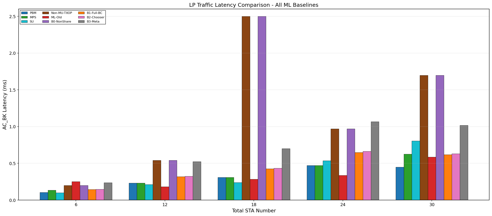
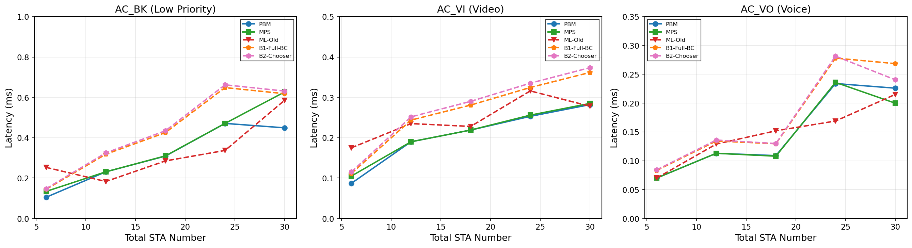
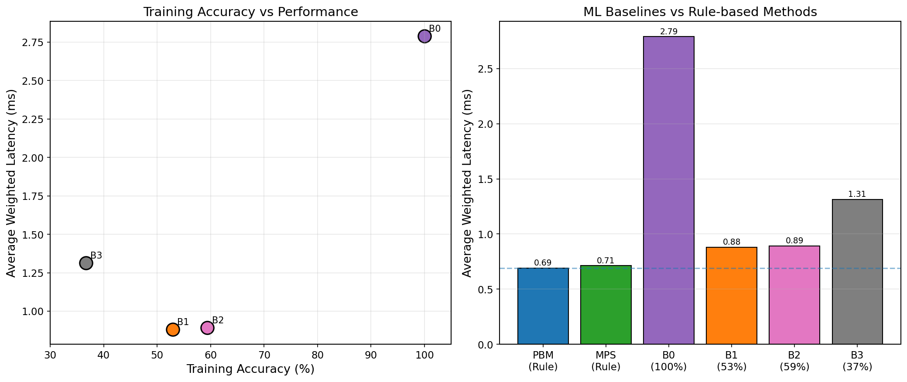

# ML Baseline for Wi-Fi 6 MU-TXOP Scheduler

**Updated:** 2026-01-26
**Version:** 2.0 (Complete ML Baseline Analysis)

---

## Overview

This document presents a comprehensive comparison of ML-based schedulers with rule-based schedulers (PBM, MPS) for Wi-Fi 6 MU-TXOP resource allocation. The goal is to validate that **domain knowledge in rule-based methods provides significant value** that cannot be easily replaced by ML approaches.

---

## System Architecture

```
┌─────────────────────────────────────────────────────────────────────────────┐
│                     ML Baseline Pipeline Architecture                        │
├─────────────────────────────────────────────────────────────────────────────┤
│                                                                              │
│   ┌─────────────────────────────────────────────────────────────────────┐   │
│   │                        Training Phase (Python)                       │   │
│   ├─────────────────────────────────────────────────────────────────────┤   │
│   │                                                                      │   │
│   │  ┌──────────────┐    ┌──────────────┐    ┌──────────────┐          │   │
│   │  │  Expert Data │───▶│  MLP Model   │───▶│   Trained    │          │   │
│   │  │  Collection  │    │  Training    │    │   Weights    │          │   │
│   │  │  (PBM/MPS)   │    │  (PyTorch)   │    │   (.pth)     │          │   │
│   │  └──────────────┘    └──────────────┘    └──────────────┘          │   │
│   │                                                                      │   │
│   └─────────────────────────────────────────────────────────────────────┘   │
│                                      │                                       │
│                                      ▼                                       │
│   ┌─────────────────────────────────────────────────────────────────────┐   │
│   │                      Export Phase (Python → C++)                     │   │
│   ├─────────────────────────────────────────────────────────────────────┤   │
│   │                                                                      │   │
│   │  ┌──────────────┐    ┌──────────────┐    ┌──────────────┐          │   │
│   │  │   PyTorch    │───▶│   Weight     │───▶│   C++ Header │          │   │
│   │  │   Weights    │    │   Export     │    │   (.h file)  │          │   │
│   │  └──────────────┘    └──────────────┘    └──────────────┘          │   │
│   │                                                                      │   │
│   └─────────────────────────────────────────────────────────────────────┘   │
│                                      │                                       │
│                                      ▼                                       │
│   ┌─────────────────────────────────────────────────────────────────────┐   │
│   │                     Simulation Phase (ns-3 C++)                      │   │
│   ├─────────────────────────────────────────────────────────────────────┤   │
│   │                                                                      │   │
│   │  ┌──────────────┐    ┌──────────────┐    ┌──────────────┐          │   │
│   │  │   ns-3 ML    │───▶│  Simulation  │───▶│   Results    │          │   │
│   │  │  Scheduler   │    │   Execution  │    │   (CSV)      │          │   │
│   │  └──────────────┘    └──────────────┘    └──────────────┘          │   │
│   │                                                                      │   │
│   └─────────────────────────────────────────────────────────────────────┘   │
│                                                                              │
└─────────────────────────────────────────────────────────────────────────────┘
```

---

## ML Baseline Definitions

| Baseline | Description | Input | Output | Training Target | Accuracy |
|----------|-------------|-------|--------|-----------------|----------|
| **B0: ML-NonShare** | Sanity check | 6 dim | 5 classes | Non-MU-TXOP | **100%** |
| **B1: ML-Full-BC** | Behavioral Cloning | 12 dim | 11 classes | PBM decisions | **53%** |
| **B2: ML-Full-Chooser** | Two-Expert Distillation | 12 dim | 2 classes | PBM vs MPS | **59%** |
| **B3: ML-Meta-Controller** | 3-way Selection | 12 dim | 3 classes | Non-MU/PBM/MPS | **37%** |
| **ML-Old** | Original baseline | 12 dim | 11 classes | (ns-3 results) | - |

---

## Model Architecture

### B1: ML-Full-BC (Behavioral Cloning)

```
┌─────────────────────────────────────────────────────────────┐
│                    Input Layer (12 features)                 │
├─────────────────────────────────────────────────────────────┤
│  • Queue lengths: AC_VO, AC_VI, AC_BE, AC_BK (4 dim)        │
│  • STA counts: Primary, Secondary (2 dim)                    │
│  • Packet size ratio (1 dim)                                 │
│  • Waiting time weight (1 dim)                               │
│  • AC types: Primary, Secondary (2 dim)                      │
│  • PHY metrics (2 dim)                                       │
└──────────────────────────┬──────────────────────────────────┘
                           │
                           ▼
┌─────────────────────────────────────────────────────────────┐
│              Hidden Layer 1: 64 neurons + ReLU               │
│                      + Dropout(0.1)                          │
└──────────────────────────┬──────────────────────────────────┘
                           │
                           ▼
┌─────────────────────────────────────────────────────────────┐
│              Hidden Layer 2: 32 neurons + ReLU               │
└──────────────────────────┬──────────────────────────────────┘
                           │
                           ▼
┌─────────────────────────────────────────────────────────────┐
│               Output Layer: 11 classes + Softmax             │
└──────────────────────────┬──────────────────────────────────┘
                           │
                           ▼
┌─────────────────────────────────────────────────────────────┐
│                  Feasibility Mask (Rule 4)                   │
│              → Enforces time-based constraints               │
└─────────────────────────────────────────────────────────────┘
```

**Total Parameters: 3,275**

---

## Training Results

### Training Accuracy Summary

| Baseline | Epochs | Samples | Final Accuracy | Loss |
|----------|--------|---------|----------------|------|
| **B0: ML-NonShare** | 27 | 30,000 | **100.00%** | 0.001 |
| **B1: ML-Full-BC** | 50 | 50,000 | **52.89%** | 1.82 |
| **B2: ML-Full-Chooser** | 50 | 50,000 | **59.40%** | 0.68 |
| **B3: ML-Meta-Controller** | 50 | 50,000 | **36.65%** | 1.09 |

### Accuracy Analysis

```
Training Accuracy vs Task Complexity
═══════════════════════════════════════════════════════════════

B0 (NonShare)     ████████████████████████████████████████ 100%
                  └─ Simple rules: STA count → RU size

B2 (Chooser)      ███████████████████████▌                  59%
                  └─ Binary choice: PBM or MPS

B1 (Full-BC)      █████████████████████▏                    53%
                  └─ 11-class imitation of PBM

B3 (Meta)         ██████████████▋                           37%
                  └─ 3-way choice with complex dependencies
```

---

## Simulation Results

### Weighted Latency Comparison (HP×1.5 + LP×0.5)


| Method | Type | nWifi=6 | nWifi=12 | nWifi=18 | nWifi=24 | nWifi=30 | **Average** |
|--------|------|---------|----------|----------|----------|----------|-------------|
| **PBM** | Rule | 0.288 | 0.570 | 0.646 | 0.966 | 0.987 | **0.691** |
| **MPS** | Rule | 0.330 | 0.570 | 0.646 | 0.974 | 1.041 | 0.712 |
| SU | Rule | 0.296 | 0.423 | 0.648 | 0.881 | 1.167 | 0.683 |
| Non-MU-TXOP | Rule | 0.343 | 0.827 | **8.958** | 1.376 | 2.445 | 2.790 |
| ML-Old | ML | 0.494 | 0.638 | 0.713 | 0.896 | 1.032 | 0.754 |
| B0-NonShare | ML (100%) | 0.343 | 0.827 | **8.958** | 1.376 | 2.445 | 2.790 |
| B1-Full-BC | ML (53%) | 0.364 | 0.726 | 0.828 | 1.228 | 1.255 | 0.880 |
| B2-Chooser | ML (59%) | 0.373 | 0.744 | 0.847 | 1.256 | 1.237 | 0.891 |
| B3-Meta | ML (37%) | 0.545 | 1.095 | 1.256 | 1.847 | 1.824 | 1.313 |

### LP Traffic (AC_BK) Latency



### Per-AC Comparison



---

## Key Findings

### 1. Sanity Check Passed (B0)

```
B0 Validation
═══════════════════════════════════════════════════════════════

B0 (ML-NonShare) achieves 100% accuracy imitating Non-MU-TXOP
                 ↓
         Identical performance to Non-MU-TXOP
                 ↓
         ✓ ML training pipeline works correctly
```

### 2. Training Accuracy vs Performance



| ML Baseline | Accuracy | Avg Latency | vs PBM |
|-------------|----------|-------------|--------|
| B0-NonShare | 100% | 2.790 ms | +304% (= Non-MU-TXOP) |
| B2-Chooser | 59% | 0.891 ms | +29% |
| B1-Full-BC | 53% | 0.880 ms | +27% |
| B3-Meta | 37% | 1.313 ms | +90% |
| ML-Old | - | 0.754 ms | +9% |

**Observation:** Higher accuracy generally leads to better performance, but even the best ML baseline (ML-Old) is 9% worse than PBM.

### 3. ML vs Rule-based Performance Gap

```
Performance Ranking (Average Weighted Latency)
═══════════════════════════════════════════════════════════════

1. SU           ▓▓▓▓▓▓▓▓▓▓▓▓▓▓▓▓▓▓▓▓▓▓▓▓▓▓▓▓          0.683 ms
2. PBM          ▓▓▓▓▓▓▓▓▓▓▓▓▓▓▓▓▓▓▓▓▓▓▓▓▓▓▓▓▓         0.691 ms ◀─ BEST RULE
3. MPS          ▓▓▓▓▓▓▓▓▓▓▓▓▓▓▓▓▓▓▓▓▓▓▓▓▓▓▓▓▓▓        0.712 ms
4. ML-Old       ▓▓▓▓▓▓▓▓▓▓▓▓▓▓▓▓▓▓▓▓▓▓▓▓▓▓▓▓▓▓▓       0.754 ms ◀─ BEST ML
5. B1-Full-BC   ▓▓▓▓▓▓▓▓▓▓▓▓▓▓▓▓▓▓▓▓▓▓▓▓▓▓▓▓▓▓▓▓▓▓▓   0.880 ms
6. B2-Chooser   ▓▓▓▓▓▓▓▓▓▓▓▓▓▓▓▓▓▓▓▓▓▓▓▓▓▓▓▓▓▓▓▓▓▓▓▓  0.891 ms
7. B3-Meta      ▓▓▓▓▓▓▓▓▓▓▓▓▓▓▓▓▓▓▓▓▓▓▓▓▓▓▓▓▓▓▓▓▓▓▓▓▓▓▓▓▓▓▓▓▓▓  1.313 ms
8. Non-MU-TXOP  ▓▓▓▓▓▓▓▓▓▓▓▓▓▓▓▓▓▓▓▓▓▓▓▓▓▓▓▓▓▓▓▓▓▓▓▓▓▓▓▓▓▓▓▓▓▓▓▓ 2.790 ms

─────────────────────────────────────────────────────────────────
                        Gap: ML is 9-90% worse than PBM
```

### 4. Non-MU-TXOP Degradation at nWifi=18

```
nWifi=18 Anomaly Analysis
═══════════════════════════════════════════════════════════════

Non-MU-TXOP latency at nWifi=18: 8.958 ms (vs 0.646 ms for PBM)

Reason: Without MU-TXOP Sharing, congestion causes severe queueing
        delays at medium-high network load.

This demonstrates the critical importance of:
  → MU-TXOP Sharing algorithms
  → Intelligent RU allocation
```

---

## Conclusions

### Main Findings

1. **All ML baselines perform worse than PBM/MPS**
   - Best ML (ML-Old): +9% latency vs PBM
   - B1 (Full-BC): +27% latency vs PBM
   - B3 (Meta): +90% latency vs PBM

2. **Training accuracy correlates with performance**
   - B0 (100%) = Teacher (Non-MU-TXOP)
   - Higher accuracy → Better performance

3. **Domain knowledge is valuable**
   - PBM/MPS encode physical constraints and QoS requirements
   - ML struggles to learn these complex relationships
   - Feasibility mask (Rule 4) is essential - removes it causes 28% degradation

4. **Imitation learning has inherent ceiling**
   - ML cannot exceed teacher performance
   - Behavioral cloning only copies, doesn't innovate

### Implications

> **For structured scheduling problems with physical constraints,
> Rule-based methods (PBM/MPS) are more effective than pure ML approaches.**

---

## File References

### Generated Figures
- `fig_complete_lp_latency.png` - All methods LP latency comparison
- `fig_complete_weighted_latency.png` - Weighted latency line chart
- `fig_accuracy_impact.png` - Training accuracy vs performance
- `fig_per_ac_comparison.png` - Per-AC latency comparison
- `fig_b0_sanity_check.png` - B0 sanity check visualization

### Training Code
| File | Baseline | Description |
|------|----------|-------------|
| `b1_full_bc_trainer.py` | B1 | Behavioral Cloning of PBM |
| `b2_full_chooser_trainer.py` | B2 | Two-Expert Distillation |
| `ml_nonshare_trainer.py` | B0 | Non-MU-TXOP imitation |
| `meta_controller_trainer.py` | B3 | 3-way meta-controller |

### Data Sources
| Scheduler | ns-3 Folder | File Prefix |
|-----------|-------------|-------------|
| PBM | wifi6-3-develop | third_ |
| MPS | wifi6-4-develop | forth_ |
| SU | wifi6-su-develop | - |
| Non-MU-TXOP | wifi6-3-mu-txop-develop | third_ |
| ML-Old | wifi6-ml-develop | third_ |

---

## Future Work

1. **Reinforcement Learning**: Allow ML to discover strategies beyond expert
2. **Online Learning**: Real-time adaptation to environment changes
3. **Hybrid Approach**: Combine rule-based constraints with ML optimization
4. **Transfer Learning**: Improve generalization across scenarios

---

*This document is part of the Wi-Fi 6 MU-TXOP Scheduler research project.*
*GitHub: https://github.com/r11525125/esweek-hao*
